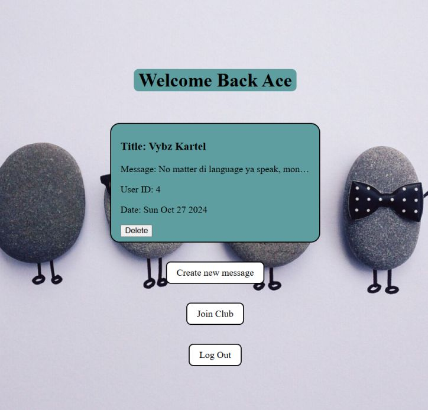
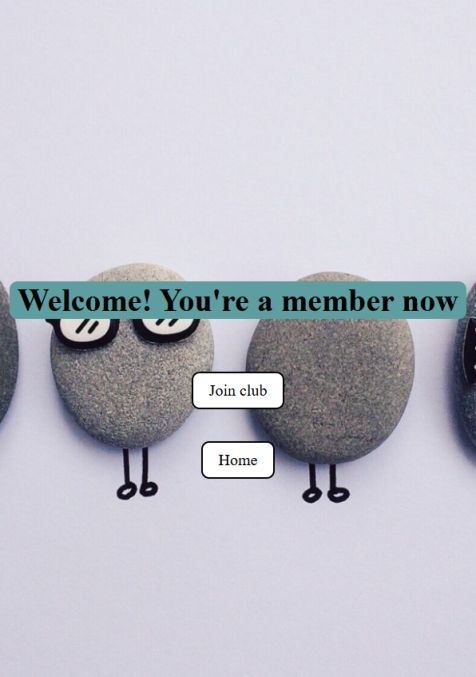

<div align='center'>

# Members Only

</div>
<div align='center'>
    <h3>💻 Technologies</h3>
    
    
    
    
    
    
    
    
    
    
    
    
    <h4><a href="https://fileuploader-5pnx.onrender.com/">Live Preview</a></h4>
</div>

<!-- **Demo:** -->

<!--  -->

<details>

**<summary>Screen views</summary>**

**Desktop View:**


<br>

**Tablet View:**


<br>

**Mobile View:**



</details>

## 🌐 Origin

[The Odin Project](https://www.theodinproject.com/)

## 📝 Description

Enables users sign up to become members to post messages or join a club

<details>
<summary>Features</summary>

- ###

</details>

## 🎯 Relevance

To solidify concepts of `Authentication` in NodeJS.

## 👥 Intended Audience

Developers, users, and non-developers.

> [!NOTE]
> Users can install all dependencies using `package.json` file via:
>
> ```bash
> npm install
> ```
>
> To use `manageDeployments.sh`:
>
> ```bash
> sudo apt install gh
> gh auth login
> sudo apt-get install jq
> chmod +x manageDeployments.sh
> ./manageDeployments.sh
> ```

## 📂 Files

<details>
<summary>Invert</summary>

| File              | Description                                                                             |
| ----------------- | --------------------------------------------------------------------------------------- |
| `app.js`          | The main JavaScript entry point that bundling begins.                                   |
| `controllers/*`   | Functions that handle routes.                                                           |
| `views/*`         | EJS (Embedded JavaScript) files.                                                        |
| `db/*`            | Database files.                                                                         |
| `public/*`        | Contains favicon and stylesheet that should be public for deployment service - Railway. |
| `package*`        | Contains details of project and dependencies versions.                                  |
| `readme-assets/*` | Live demo and different screen views used in `README.md`.                               |

</details>

## ©️ Credit

<details>
<summary>Invert</summary>

| File | Description |
| ---- | ----------- |

</details>

## 🔄 Improvements

<details>
<summary>Invert</summary>

- [ ] Make logIn and SignUp page more presentable

</details>

## 👤 Curator

1. [Name](https://github.com/asdacosta)

**[🞁 Top](#members-only)**
